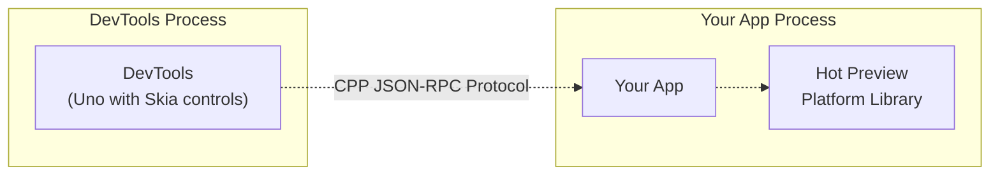

# Architecture

HotPreview is designed as a cross-platform UI component preview system for .NET, with a modular architecture that separates concerns and enables platform-specific implementations.

## System Overview



## Core Components

### 1. HotPreview Core Library

**Location:** `src/HotPreview/`
**Purpose:** Base attributes and types for defining previews

**Key Components:**
- `PreviewAttribute` - Marks methods as preview definitions
- `UIComponentAttribute` - Explicitly marks classes as UI components
- `PreviewCommandAttribute` - Defines executable commands
- `AutoGeneratePreviewAttribute` - Controls auto-generation behavior

### 2. HotPreview Shared Model

**Location:** `src/HotPreview.SharedModel/`
**Purpose:** Cross-platform protocol and reflection utilities

**Key Components:**
- **Protocol Definitions:** JSON-RPC interfaces for tool communication
- **Reflection Utilities:** Component and preview discovery at runtime
- **App Services:** Base classes for platform-specific implementations

**Protocol Classes:**
```csharp
public interface IPreviewAppService
{
    Task<UIComponentInfo[]> GetComponentsAsync();
    Task<UIComponentInfo?> GetComponentAsync(string componentName);
    Task NavigateToPreviewAsync(string componentName, string previewName);
    Task<byte[]> GetPreviewSnapshotAsync(string componentName, string previewName);
    Task<CommandInfo[]> GetCommandsAsync();
    Task<CommandInfo?> GetCommandAsync(string commandName);
    Task InvokeCommandAsync(string commandName);
}
```

### 3. Platform Applications

**Location:** `src/platforms/`
**Purpose:** Platform-specific preview applications

#### MAUI Implementation (`HotPreview.App.Maui`)
- `MauiPreviewApplication` - Main application service
- `MauiPreviewNavigatorService` - Navigation handling
- `PreviewsPage` - UI for displaying component tree
- Platform-specific resource handling

#### WPF Implementation (`HotPreview.App.Wpf`) *(Planned)*
- Similar structure adapted for WPF platform
- Windows-specific navigation and rendering

### 4. DevTools Infrastructure

**Location:** `src/tooling/`
**Purpose:** Visual development environment and tooling

#### DevTools Application (`HotPreview.DevToolsApp`)
- **Uno Desktop App:** Main user interface
- **Connection Management:** Handles multiple app connections
- **Component Tree View:** Hierarchical navigation interface
- **Command Execution:** UI for running preview commands

#### DevTools Launcher (`HotPreview.DevTools`)
- **Global Tool:** `dotnet tool install -g HotPreview.DevTools`
- **Process Management:** Launches and manages DevTools instances
- **Single Instance Logic:** Prevents multiple DevTools instances

#### Tooling Infrastructure (`HotPreview.Tooling`)
- **Roslyn Analysis:** Component discovery through source analysis
- **JSON-RPC Server:** Communication protocol implementation
- **MCP Server:** AI integration capabilities
- **Visual Testing:** Screenshot and comparison utilities

## CPP - Component Preview Protocol

### JSON-RPC Over TCP

HotPreview uses JSON-RPC over TCP for communication between DevTools and applications.

**Message Flow:**
1. **App Startup:** Application connects to DevTools via TCP
2. **Discovery:** DevTools requests component and preview information
3. **Navigation:** User clicks component, DevTools sends navigation command
4. **Command Execution:** User triggers command, DevTools forwards to app

**Example Messages:**
```json
// Get Components Request
{
  "jsonrpc": "2.0",
  "id": 1,
  "method": "components/list",
  "params": {}
}

// Navigate to Preview Request
{
  "jsonrpc": "2.0",
  "id": 2,
  "method": "previews/navigate",
  "params": {
    "componentName": "MyApp.Views.ProductCard",
    "previewName": "DefaultPreview"
  }
}
```

For the complete protocol specification, including all method definitions, data types, and validation rules, see the [Component Preview Protocol (CPP) documentation](cpp-protocol.md).

## Component Discovery

### Runtime Discovery (Reflection)

**Location:** `HotPreview.SharedModel/App/GetPreviewsViaReflection.cs`

**Process:**
1. **Assembly Scanning:** Scan loaded assemblies for components
2. **Type Analysis:** Identify types inheriting from platform base types
3. **Attribute Detection:** Find `[Preview]` and `[UIComponent]` attributes
4. **Auto-Generation:** Create default previews for discovered components

**Example Code:**
```csharp
public static PreviewInfo[] GetPreviews(Assembly assembly)
{
    var types = assembly.GetTypes()
        .Where(t => IsUIComponent(t))
        .ToArray();

    return types.SelectMany(CreatePreviewsForType).ToArray();
}
```

### Build-Time Discovery (Roslyn)

**Location:** `HotPreview.Tooling/GetPreviewsFromRoslyn.cs`

Note: Currently this code is not used, with runtime discovery used exclusively, but
it may be used for future  scenarios.

**Process:**
1. **Source Analysis:** Parse C# source files using Roslyn
2. **Syntax Tree Walking:** Find class declarations and attributes
3. **Preview Method Detection:** Locate `[Preview]` methods
4. **Metadata Generation:** Create preview metadata without runtime loading

**Benefits:**
- No runtime overhead
- Works with uncompiled code
- Better performance for large applications

## MSBuild Integration

### Build Tasks

**Location:** `src/HotPreview.AppBuildTasks/`

**Key Tasks:**
- `GeneratePreviewAppSettingsTask` - Creates app configuration
- **DevTools Launch:** Automatically starts DevTools during builds
- **Symbol Definition:** Ensures `PREVIEWS` symbol is defined in Debug builds

**Integration Points:**
```xml
<Target Name="LaunchDevTools" BeforeTargets="Build" Condition="$(Configuration) == 'Debug'">
  <Exec Command="hot-preview" ContinueOnError="true" />
</Target>
```

## Platform Abstraction

### Base Type Configuration

Platform-specific base types are configured via assembly attributes:

```csharp
[assembly: ControlUIComponentBaseType("MAUI", "Microsoft.Maui.Controls.View")]
[assembly: PageUIComponentBaseType("MAUI", "Microsoft.Maui.Controls.Page")]
```

### Service Implementation

Each platform implements the core interfaces:

```csharp
public class MauiPreviewApplication : PreviewApplication
{
    protected override IPreviewNavigator CreateNavigator()
        => new MauiPreviewNavigatorService();

    protected override IUIComponentExclusionFilter CreateExclusionFilter()
        => new MauiUIComponentExclusionFilter();
}
```

## AI Integration (MCP Server)

Note: This feature is a work in progress and not yet fully implemented.

### Model Context Protocol

**Location:** `HotPreview.Tooling/McpServer/`

**Capabilities:**
- **Device Management:** Android/iOS device discovery and control
- **Screenshot Capture:** Automated visual testing
- **App Management:** Launch and control preview applications
- **Preview Generation:** AI-assisted component creation

**Architecture:**
```
┌─────────────┐    ┌─────────────┐    ┌─────────────┐
│ AI Agent    │◄──►│ MCP Server  │◄──►│ HotPreview  │
│ (Claude)    │    │             │    │   DevTools  │
└─────────────┘    └─────────────┘    └─────────────┘
```

## Visual Testing

### Snapshot Generation

**Location:** `HotPreview.Tooling/VisualTestUtils/`

**Components:**
- `IImageEditor` - Image manipulation interface
- `IVisualComparer` - Visual difference detection
- `VisualRegressionTester` - Test orchestration
- **MagickNet Integration:** ImageMagick-based image processing

**Workflow:**
1. **Capture Screenshot:** Take snapshot of component
2. **Compare Images:** Detect visual differences
3. **Generate Report:** Create difference visualization
4. **Assert Results:** Integrate with test frameworks

## Extension Points

### Custom Platform Support

To add support for a new platform:

1. **Implement Base Services:**
   ```csharp
   public class MyPlatformPreviewApplication : PreviewApplication
   {
       // Platform-specific implementation
   }
   ```

2. **Configure Base Types:**
   ```csharp
   [assembly: ControlUIComponentBaseType("MyPlatform", "MyPlatform.Controls.Control")]
   ```

3. **Create Package:** Distribute as `HotPreview.App.MyPlatform`
